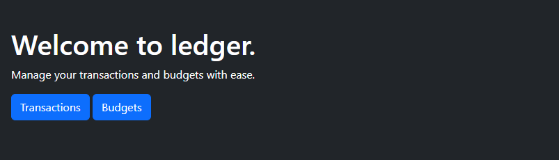
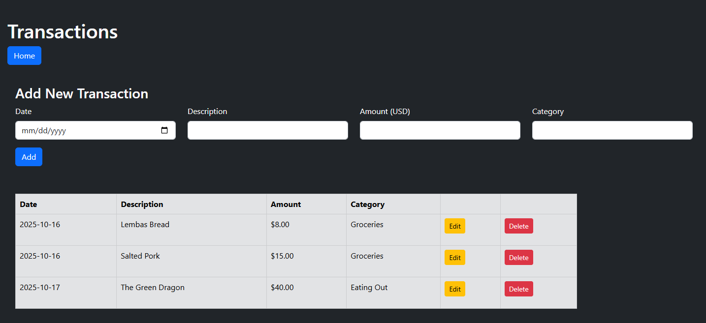
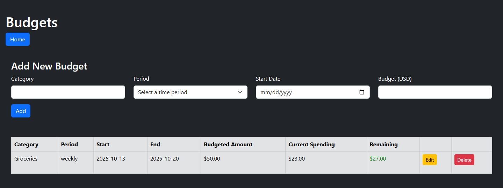

# ledger
A full-stack web app that simplifies your budgeting routine.

## Setup
I recommend running ledger as a containerized application, as it is not yet fully deployed.  Please note that these instructions were tested on a Windows 11 machine running Ubuntu 24.04.2 on WSL.

1. Clone this repo onto your local machine.
2. Install Docker.  I recommend downloading [Docker Desktop](https://www.docker.com/products/docker-desktop/) for your machine's platform.
3. Open a terminal and run the following command from the root of the project (it may take a few minutes to complete):

   ```Bash
   docker compose up
   ```
   Once the process is complete, 2 containers will be running on your machine (one for the Postgres service, and one for the web server).
4. Open a web browser and navigate to ```localhost::8080```.  You should now see the ledger homepage!
   
## Usage
ledger allows you to manage both individual transactions and budgets, both of which are accessible from the homepage.



Navigate to the Transactions page to view a list of all recorded transactions.  You can add a new transaction, edit an existing transaction, or delete a transaction.



Navigate to the Budgets page to view a list of all recorded budgets.  A budget contains information about how much you've spent within a given category during a specific time period, and how much you're over (or under) your budget target.  Like transactions, you can also add, edit, and delete budgets.

In the example below, we've budgeted $50.00 for Groceries for the week beginning 13 October 2025.  We've already spent $23.00 (from the Lembas Bread and Salted Pork transactions), which leaves us with $27.00 in our Groceries budget for the week.



## Troubleshooting
- Sometimes you may encounter an issue that has been fixed in a recent image.  To ensure you are using the most recent image when running via Docker compose, delete all existing ledger-related containers and images on your local machine first.